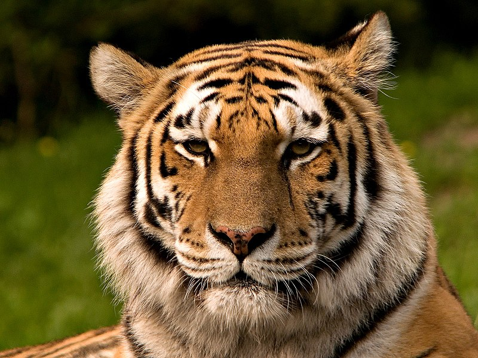
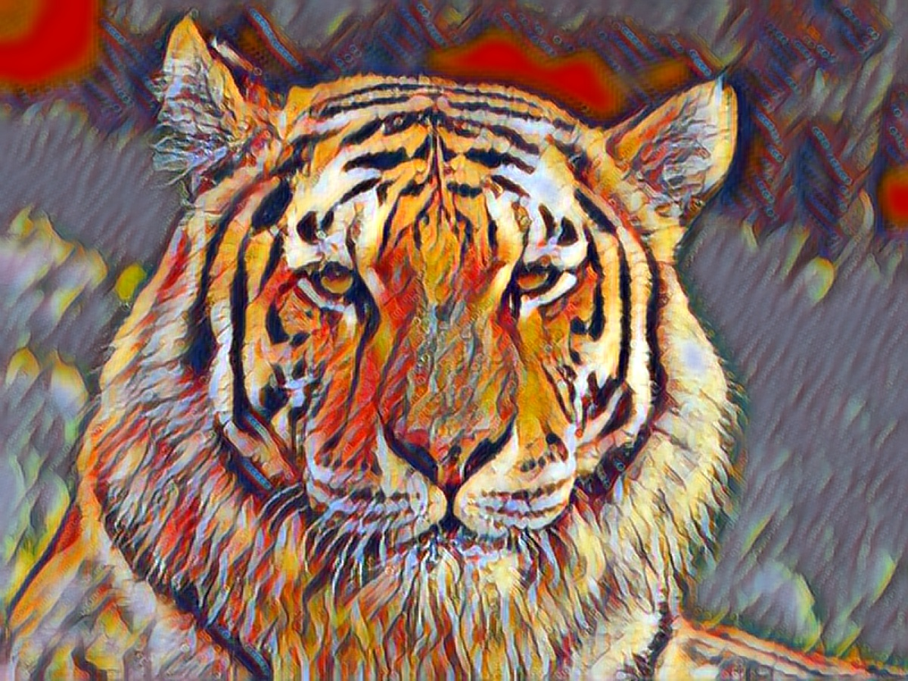
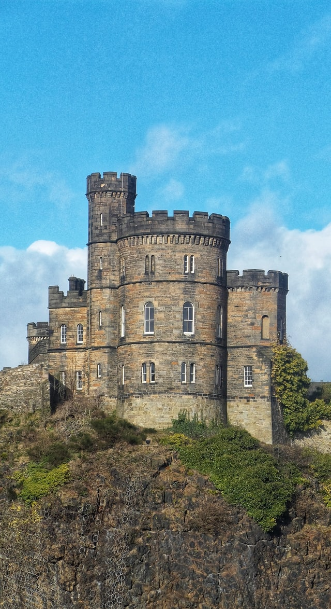
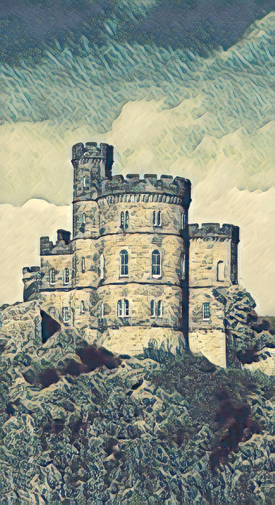

# DeepImage

Deep Learning Image transformation API. For now only neural style transfer is implemented. It's using pre-trained model.

### Stylize Images Using Pre-trained Multi-Style Generative Network

Build the app and run it on the 0.0.0.0:5000 port.

0. Clone the repo

    ```bash
    git clone https://github.com/Piotrekszmel/DeepImage.git
    cd DeepImage
    ```

## First way

1. Download the pre-trained model

    ```bash
    bash scripts/download_model.sh
    ```

2. Run the app

    ```bash
    python3 main.py
    ```

## Second way

1. Use Docker

    ```bash
    bash start.sh
    ```

### Examples

<p float="left">
    
    
</p>

<p float="left">
    
    
</p>
