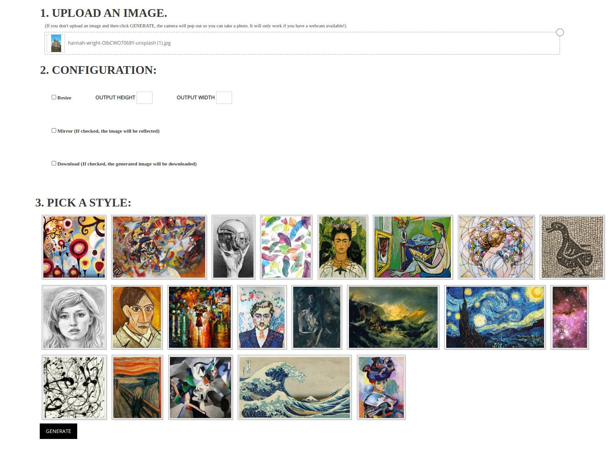

# DeepImage

Deep Learning Image transformation API. For now only neural style transfer is implemented. It's using pre-trained model.

### Stylize Images Using Pre-trained Multi-Style Generative Network

Clone the repo, build the app and run it on the 0.0.0.0:5000 port.

0. Clone the repo

    ```bash
    git clone https://github.com/Piotrekszmel/DeepImage.git
    cd DeepImage
    ```

## First way

1. Download the pre-trained model

    ```bash
    bash scripts/download_model.sh
    ```

2. Run the app

    ```bash
    python3 main.py
    ```

## Second way

1. Run the script that will start the docker container

    ```bash
    bash start.sh
    ```

### APP



## FLOW

1. Upload an image or make a photo with webcam.

2. Set up the configuration

3. Pick a style

4. Generate

### Examples

<p float="left">
    
    
</p>

<p float="left">
    
    
</p>
